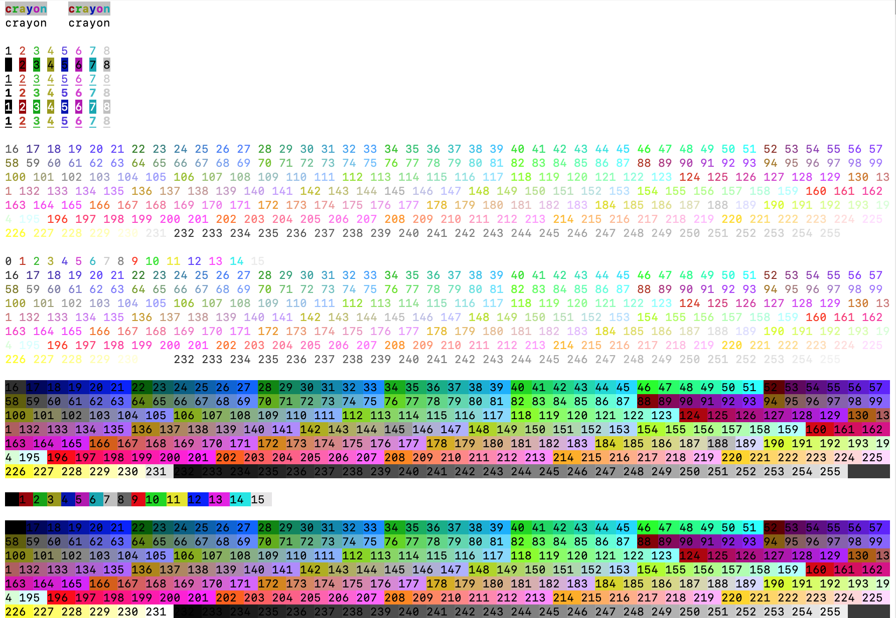

# `crayon`

A simple library for rich text in ANSI terminal written in Rust.

## Reference

- "Build your own Command Line with ANSI escape codes" - Li Haoyi https://www.lihaoyi.com/post/BuildyourownCommandLinewithANSIescapecodes.html